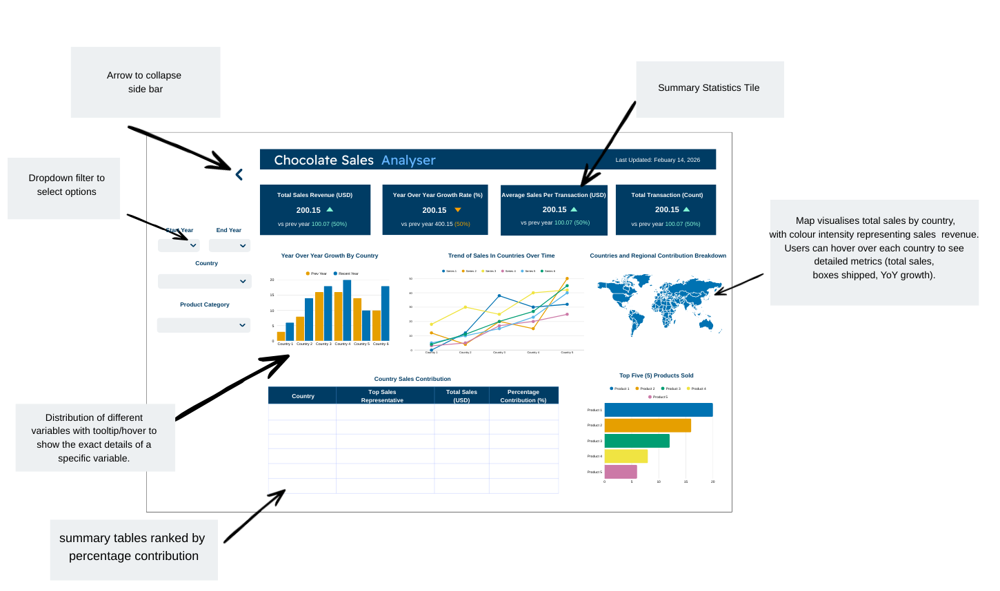

# Proposal: Chocosales Analyser

## Section 1: Motivation and Purpose

> **Our role:** Data scientist consultancy firm specializing in business analytics
> **Target audience:** Sales Managers and business analysts especially in the confectionery industry
>
> Global chocolate sales operations are bringing us substaintial volumes of transactional data across countries, products and individual sales representatives. However, managers mostly rely on those static reports or aggregated summaries, which makes it hard to understand what affects the performance and identify the growth opportunities. Without interactive exploration tools, it could be challenging to determine which region, products or individuals contribute most to revenue growth.
>
> To address this challenge, our goal is to build an interactive data visualization dashoard that enables sales managers to explore global chocolate sales performance from 2022 to 2025. Our app allows users to check total sales and the trend, compare performance across countries and products, also evaluate individual sales representatives through filtering, ranking and other time-based trend analysis. Users can interactively explore the dataset via our dashboard, make more informed strategic decisions related to resource allocation, product focus, and regional expansion based on this supportive tool.

## Section 2: Description of the Data

> We will be visualizing the **Chocolate Sales** dataset from Kaggle, which contains approximately 3,282 transaction records spanning the years 2022 to 2025. Each record represents a single chocolate sales transaction and includes several variables that describe the context and magnitude of the sale.
>
> The dataset includes the following key characteristics:
>
> - **Sales Representative Information** (`Sales Person`)
> The name of the salesperson responsible for the transaction, enabling performance comparison across individuals.
> - **Geographic Information** (`Country`)
> The country where the sale occurred, allowing for regional analysis and cross-country comparisons.
> - **Product Information** (`Product`)
> The name and type of chocolate product sold, which supports product-level performance evaluation.
> - **Temporal Information** (`Date`)
> The date of the transaction (DD/MM/YYYY format), enabling time-series trend analysis and year-over-year comparisons.
> - **Sales Metrics**
> `Amount`: Total sales value of the transaction (in USD).
> `Boxes Shipped`: Number of boxes shipped as part of the transaction.
> Using this data, we will derive additional variables to support exploratory analysis, such as:
> - Year and Month (extracted from Date) for trend visualization.
> - Year-over-Year Growth Metrics at aggregated levels.
> - Aggregated Sales per Country/Product/Sales Person to enable ranking and comparison.
> - Average Transaction Value to evaluate pricing and sales intensity.
> These variables directly support decision-making related to revenue growth, sales performance monitoring, and product strategy optimization.

## Section 3: Research Questions & Usage Scenarios

### Usage Scenario

> Jordan is a sales manager overseeing chocolate sales across multiple countries. Jordan is responsible for evaluating performance, identifying high-growth market trend, and allocating sales resources effectively. However, reviewing static spreadsheets makes it difficult to quickly understand which segments are driving growth.
>
> When Jordan logs into our **ChocoSales Analyser** dashboard, he first sees an overview of total sales and overall performance trends over time. Using interactive filters (Year, Country, Product), Jordan can explore specific segments of interest. For example, Jordan may filter the dashboard to view 2024 performance in Australia and observe that certain premium dark chocolate products contribute disproportionately to revenue.
>
> Jordan can then compare sales representatives to identify top performers and assess whether growth is concentrated among a few individuals or broadly distributed across the team. By exploring ranked product performance and year-over-year growth patterns, Jordan gains actionable insights to guide marketing focus, inventory decisions, and performance incentives.
>
> Based on findings from the dashboard, Jordan may decide to invest more resources in high-performing countries or provide additional support and training to underperforming areas.

### Jobs to Be Done

> **JTBD 1:**
>
> - **Situation:** When I'm reviewing sales performance across multiple countries over time...
> - **Motivation:** I want to compare country-level sales trends and summarize year-over-year growth to understand which markets are improving faster or slower...
> - **Outcome:** So that I can prioritize high-growth markets and make informed decisions about regional investment and strategic focus.
>
> **JTBD 2:**
>
> - **Situation:** When I am evaluating the overall product performance...
> - **Motivation:** I want to explore the ranking of products based on total sales or average transaction value to assess which product generates the most profitability...
> - **Outcome:** So I can prioritize high-performing products in marketing and promotional strategies.
>
> **JTBD 3:**
>
> - **Situation:** When evaluating team performance across sales representatives...
> - **Motivation:** I want to compare sales representatives across regions and products...
> - **Outcome:** So I can reward high performers and provide targeted support where needed.

## Section 4: Exploratory Data Analysis

> *To address JTBD 1 (comparing country-level trends and identifying faster vs slower growing markets), we analyzed sales Amount ($) over time by country.*
>
> **Notebook:** [`notebooks/eda_analysis.ipynb`](../notebooks/eda_analysis.ipynb)
>
> **Analysis:** In `notebooks/eda_analysis.ipynb`, the quarterly line chart shows that country sales fluctuate quarter-to-quarter, which provides context on how each market changes over time. To summarize growth more clearly, the YoY growth bar chart (Jan–Aug 2024 vs Jan–Aug 2023) ranks markets by percent change; all markets grew in this window, with India growing the most (about 5.7%) and New Zealand the least (about 4.2%).
>
> **Reflection:** This supports our dashboard design: users need a time trend view (with a country filter) to explore changes over time, plus a growth comparison view (YoY % change) to quickly prioritize high-growth markets for regional investment and strategic focus.

## Section 5: App Sketch & Description

> The app contains a landing page that shows the distributions which convey sales in various countries in a Year over Year (YoY) change comparison, a trend chart coloured by the different countries and top five products in top ranking country by default. There are also statistic tiles, a table and a map which provides more details about the different segments driving growth. From the dropdown filters on the left, the user can select the start year, end year, country and product of interest. There is also an option to collapse the sidebar to allow the user to view the key metrics in full screen. These filters can also be reset to return the defualt view. 

> Furthmore, hovering over the charts displays detailed tooltips with the exact values. The legend items can also be clicked to toggle the visibility of specific countries/products. Our colour palette for categorical comaprison is color-blind friendlyand users can view the dashboard efficiently in a Z-motion. 