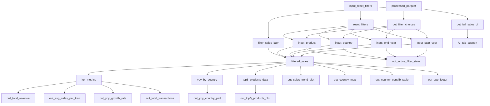

# Milestone 2 Specification

> M4 updates will be added as new sections; earlier sections are kept for history.
## Milestone 4 – Option A (QueryChat Customization) – Plan

**Goal:** Make the AI Query tab more useful and less confusing by giving QueryChat better context about our dataset and adding simple safety rules for queries.

### What we plan to do
- **Add dataset context**  
  Create `reports/querychat_data_description.md` (what the columns mean, units, etc.) and `reports/querychat_extra_instructions.md` (how we want the AI to answer for this dashboard). Then connect these files to QueryChat.

- **Add user-facing AI settings controls**  
  Add two controls in the AI tab: **Max rows returned** and **SELECT-only**. These controls let users limit the size of AI-generated query results and restrict QueryChat to read-only SQL behavior.

- **Use `on_tool_request` **  
    Intercept QueryChat tool calls to validate and adjust SQL before execution. In this milestone, we use it to enforce read-only behavior when SELECT-only is enabled and to apply a maximum row limit based on the AI settings controls.

- **Write an experiments notebook**  
  Create `notebooks/m4_querychat_experiments.ipynb` and compare a few example questions before vs after these changes. Summarize what improved.

## M4 Backend Update Summary

For Milestone 4, we updated the dashboard data backend from eager CSV loading in pandas to lazy loading using parquet + DuckDB through ibis. This change preserves the user-facing dashboard behavior while improving scalability and aligning the reactive filtering pipeline with production-style query execution. Input choices are now initialized from distinct metadata queried from parquet, and `filtered_sales` applies all filter conditions before materializing the result as a pandas DataFrame.

## 2.1 Updated Job Stories

> Status values may be adjusted after we finalize M2 MVP vs M3 stretch scope.

| # | Job Story | Status | Notes |
|---|----------|--------|------|
| 1 | When I’m reviewing sales performance across countries over time, I want to filter by year range and country and see sales trends/YoY growth, so I can spot which markets are growing faster/slower and decide where to focus. | ✅ Implemented | From M1 JTBD 1 |
| 2 | When I’m evaluating product performance, I want to filter by product category and see top products by sales (and/or average transaction value), so I can prioritize products for marketing/promos. | ✅ Implemented | From M1 JTBD 2 |
| 3 | When I’m evaluating team performance, I want to compare top sales reps under selected filters, so I can reward top performers and provide targeted support. | 🔄 Revised | From M1 JTBD 3 |
| 4 | When I’ve changed multiple filters, I want a reset button, so I can quickly return to the default view. | ✅ Implemented | Optional enhancement |

## 2.2 Component Inventory

| ID | Type | Shiny Widget/renderer | Depends On | Job Story |
|---|---|---|---|---|
| input_start_year | Input | ui.input_select() | _ | #1 |
| input_end_year | Input | ui.input_select() | _ | #1 |
| input_country | Input | ui.input_select() | _ | #1 |
| input_product| Input | ui.input_select() | - | #2 |
| input_reset_filters | Input | ui.input_action_button() | - | #4 |
| reset_filters | Reactive effect | @reactive.effect | input_reset_filters | #4 |
| filtered_sales | Reactive calc  | @reactive.calc | input_start_year, input_end_year, input_country, input_product  | #1, #2, #3 |
| kpi_metrics | Reactive calc | @reactive.calc | filtered_sales | #1, #2 |
| yoy_by_country | Reactive calc | @reactive.calc  | filtered_sales | #1 |
| top5_products_data | Reactive calc | @reactive.calc | filtered_sales | #2 |
| out_total_revenue | Output | @render.ui (returns ui.value_box()) | kpi_metrics | #1 |
| out_avg_sales_per_tran | Output | @render.ui (returns ui.value_box()) | kpi_metrics | #1 |
| out_yoy_growth_rate | Output | @render.ui (returns ui.value_box()) | kpi_metrics | #1 |
| out_total_transactions | Output | @render.ui (returns ui.value_box()) | kpi_metrics | #1 |
| out_sales_trend_plot| Output | @render.altair | filtered_sales | #1 |
| out_country_map | Output | @render.altair | filtered_sales | #1 |
| out_country_contrib_table | Output |@render.data_frame | filtered_sales | #1, #3 |
| out_yoy_country_plot | Output | @render.altair | yoy_by_country | #1 |
| out_top5_products_plot | Output | @render.altair | top5_products_data | #2 |
| out_active_filter_state | Output | @render.text| input_start_year, input_end_year, input_country, input_product | #1, #2, #3 |
| out_app_footer | Output | @render.ui | filtered_sales | #1, #2, #3, #4 |
| get_filter_choices | Data access helper | ibis + DuckDB query | processed parquet | #1, #2 |
| filter_sales_lazy | Data access helper | ibis + DuckDB query + `.execute()` | `start_year, end_year, country, product` | #1, #2, #3 |
| get_full_sales_df | Data access helper | ibis + DuckDB query + `.execute()` | processed parquet | AI tab support |

## 2.3 Reactivity Diagram

## 2.4 Calculation Details

### `get_filter_choices` (data access helper)

- **Depends on:** processed parquet dataset

- **What it does (transformation):**

1. Queries distinct values of `year`, `country`, and `product` from the processed parquet dataset through **ibis + DuckDB**.
2. Returns a small metadata DataFrame used to initialize Shiny input choices.
3. Avoids loading the full analytical dataset into memory at app startup just to build dropdown options.

- **Consumed by:**

1. `start_year` input initialization
2. `end_year` input initialization
3. `country` input initialization
4. `product` input initialization

### `filtered_sales` (@reactive.calc)

- **Depends on:** `input_start_year`, `input_end_year`, `input_country`, `input_product`
- **What it does (transformation):**

1. Reads user-selected filter values from the Shiny inputs.  
2. Calls a lazy data-access helper (`filter_sales_lazy`) backed by **ibis + DuckDB** over the processed **parquet** dataset. 
3. Applies year, country, and product filtering at the database/query layer **before** materializing results into memory.  
4. Executes the filtered query and returns only the matching rows as a pandas DataFrame for downstream plots, tables, and KPI calculations.

- **Why this changed in M4:**

To improve scalability and align with production-style data workflows, M4 switches the dashboard from eager CSV loading in pandas to lazy loading with parquet + DuckDB. This keeps filtering outside pandas until the final query result is needed.

- **Consumed by outputs / downstream calcs:**

1. **Direct outputs:** `out_sales_trend_plot`, `out_country_map`, `out_country_contrib_table`
2. **Additional output:** `out_app_footer`
3. **Downstream calcs:** `kpi_metrics`, `yoy_by_country`, `top5_products_data`

### `filter_sales_lazy` (data access helper)

- **Depends on:** processed parquet dataset, selected filter values

- **What it does (transformation):**

1. Creates a lazy ibis table over the parquet dataset using DuckDB.
2. Applies selected filters for year range, country, and product as query operations.
3. Executes the filtered query only after all filtering conditions are defined.
4. Returns a pandas DataFrame containing only matching rows.

- **Why it matters:**

This helper is the core of the M4 backend redesign. It ensures filtering happens before the data enters a DataFrame, satisfying the milestone requirement for database-level filtering.

- **Consumed by:**

1. `filtered_sales`
2. All downstream dashboard plots, tables, and KPI calculations that depend on `filtered_sales`

### `kpi_metrics` (@reactive.calc)

- **Depends on:** `filtered_sales`
- **What it does (transformation):**
Computes summary KPIs from the filtered dataset, such as:

1. **Total revenue** = sum of `sales`
2. **Average sales per transaction** = mean of `sales`
3. **Total transactions** = number of rows (or count of transactions)
4. **YoY growth rate:** compares current year vs previous year within the filtered data.

Also, returns a small DataFrame with just one row containing all KPI values so they are computed once and reused.

- **Consumed by outputs:** `out_total_revenue`, `out_avg_sales_per_tran`, `out_yoy_growth_rate`, `out_total_transactions`

### `yoy_by_country` (@reactive.calc)

- **Depends on:** `filtered_sales`
- **What it does (transformation):**

1. Aggregates sales by **country** and **year** (or year-month if needed).
2. Computes year-over-year change metrics per country (e.g., `pct_change` across years).
3. Returns a DataFrame suitable for plotting YoY comparisons.

- **Consumed by outputs:** `out_yoy_country_plot`

### `top5_products_data` (@reactive.calc)

- **Depends on:** `filtered_sales`

- **What it does (transformation):**

1. Aggregates sales by **product** (or product category if needed).
2. Computes ranking metrics (e.g., total sales, average transaction value).
3. Selects **Top 5** products based on the chosen ranking rule (for this milestone can fix to "total sales" and document that; in later milestones could add an input to switch ranking).
4. Returns the ranked Top 5 table for plotting.

- **Consumed by outputs:** `out_top5_products_plot`

### `reset_filters` (@reactive.effect, for optional enhancement)

(not a @reactive.calc, but included here for completeness because it affects the reactive system)

- **Depends on:** `input_reset_filters` via `@reactive.event(input_reset_filters)`
- **What it does:**

1. Resets UI inputs back to default values (e.g., start year = min year, end year = max year, country/product = "All").
2. This triggers updates to `filtered_sales` and all downstream outputs via normal reactivity.

### `out_active_filter_state` (@render.text)

- **Depends on:** `input_start_year`, `input_end_year`, `input_country`, `input_product`
- **What it does:**

1. Renders a short text summary of currently selected filters.
2. Makes active filter state visible to users at a glance.

### `out_app_footer` (@render.ui)

- **Depends on:** `filtered_sales`
- **What it does:**

1. Renders footer metadata (app description, authors, repo link, last updated).
2. Can include context such as filtered row count/date range from `filtered_sales`.
