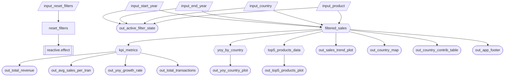

# Milestone 2 Specification

> Team note:this spec is a living document.please update the Status column (✅ / 🔄 Revised / ⏳ Pending M2 / ⏳ Pending M3) as we finalize scope and implement features,fill sections 2.2-2.4 based on the final M2 prototype.

## 2.1 Updated Job Stories

> Status values may be adjusted after we finalize M2 MVP vs M3 stretch scope.

| # | Job Story | Status | Notes |
|---|----------|--------|------|
| 1 | When I’m reviewing sales performance across countries over time, I want to filter by year range and country and see sales trends/YoY growth, so I can spot which markets are growing faster/slower and decide where to focus. | ⏳ Pending M2 | From M1 JTBD 1 |
| 2 | When I’m evaluating product performance, I want to filter by product category and see top products by sales (and/or average transaction value), so I can prioritize products for marketing/promos. | ⏳ Pending M2 | From M1 JTBD 2 |
| 3 | When I’m evaluating team performance, I want to compare top sales reps under selected filters, so I can reward top performers and provide targeted support. | 🔄 Revised and ⏳ Pending M3 (TBD) | From M1 JTBD 3 |
| 4 | When I’ve changed multiple filters, I want a reset button, so I can quickly return to the default view. | ⏳ Pending M2 (Optional) | Optional enhancement |

## 2.2 Component Inventory

| ID | Type | Shiny Widget/renderer | Depends On | Job Story |
|---|---|---|---|---|
| input_start_year | Input | ui.input_select() | _ | #1 |
| input_end_year | Input | ui.input_select() | _ | #1 |
| input_country | Input | ui.input_select() | _ | #1 |
| input_product| Input | ui.input_select() | - | #2 |
| input_reset_filters | Input | ui.input_action_button() | - | #4 |
| reset_filters | Reactive effect | @reactive.effect | input_reset_filters | #4 |
| filtered_sales | Reactive calc  | @reactive.calc | input_start_year, input_end_year, input_country, input_product  | #1, #2, #3 |
| kpi_metrics | Reactive calc | @reactive.calc | filtered_sales | #1, #2 |
| yoy_by_country | Reactive calc | @reactive.calc  | filtered_sales | #1 |
| top5_products_data | Reactive calc | @reactive.calc | filtered_sales | #2 |
| out_total_revenue | Output | ui.value_box() + @render.text | kpi_metrics | #1 |
| out_avg_sales_per_tran | Output | ui.value_box() + @render.text | kpi_metrics | #1 |
| out_yoy_growth_rate | Output | ui.value_box() + @render.text | kpi_metrics | #1 |
| out_total_transactions | Output | ui.value_box() + @render.text | kpi_metrics | #1 |
| out_sales_trend_plot| Output | @render.plot | filtered_sales | #1 |
| out_country_map | Output | @render.plot | filtered_sales | #1 |
| out_country_contrib_table | Output |@render.data_frame | filtered_sales | #1, #3 |
| out_yoy_country_plot | Output | @render.plot | yoy_by_country | #1 |
| out_top5_products_plot | Output | @render.plot | top5_products_data | #2 |
| out_active_filter_state | Output | @render.text | input_start_year, input_end_year, input_country, input_product | #1, #2, #3 |
| out_app_footer | Output | @render.ui | filtered_sales | #1, #2, #3, #4 |

## 2.3 Reactivity Diagram

## 2.4 Calculation Details

### `filtered_sales` (@reactive.calc)

- **Depends on:** `input_start_year`, `input_end_year`, `input_country`, `input_product`
- **What it does (transformation):**

1. Loads the cleaned sales dataset (e.g., from `data/raw/chocolate-sales.csv`).  
2. Filters rows to the selected year range (`start_year` to `end_year`).  
3. Applies optional filters for `country` and `product` (e.g., "All" = no filter).  
4. Returns the filtered DataFrame used across the app as the single source of truth.

- **Consumed by outputs / downstream calcs:**

1. **Direct outputs:** `out_sales_trend_plot`, `out_country_map`, `out_country_contrib_table`
2. **Additional output:** `out_app_footer`
3. **Downstream calcs:** `kpi_metrics`, `yoy_by_country`, `top5_products_data`

### `kpi_metrics` (@reactive.calc)

- **Depends on:** `filtered_sales`
- **What it does (transformation):**
Computes summary KPIs from the filtered dataset, such as:

1. **Total revenue** = sum of `sales`
2. **Average sales per transaction** = mean of `sales`
3. **Total transactions** = number of rows (or count of transactions)
4. **YoY growth rate:** compares current year vs previous year within the filtered data.

Also, returns a small DataFrame with just one row containing all KPI values so they are computed once and reused.

- **Consumed by outputs:** `out_total_revenue`, `out_avg_sales_per_tran`, `out_yoy_growth_rate`, `out_total_transactions`

### `yoy_by_country` (@reactive.calc)

- **Depends on:** `filtered_sales`
- **What it does (transformation):**

1. Aggregates sales by **country** and **year** (or year-month if needed).
2. Computes year-over-year change metrics per country (e.g., `pct_change` across years).
3. Returns a DataFrame suitable for plotting YoY comparisons.

- **Consumed by outputs:** `out_yoy_country_plot`

### `top5_products_data` (@reactive.calc)

- **Depends on:** `filtered_sales`

- **What it does (transformation):**

1. Aggregates sales by **product** (or product category if needed).
2. Computes ranking metrics (e.g., total sales, average transaction value).
3. Selects **Top 5** products based on the chosen ranking rule (for this milestone can fix to "total sales" and document that; in later milestones could add an input to switch ranking).
4. Returns the ranked Top 5 table for plotting.

- **Consumed by outputs:** `out_top5_products_plot`

### `reset_filters` (@reactive.effect, for optional enhancement)

(not a @reactive.calc, but included here for completeness because it affects the reactive system)

- **Depends on:** `input_reset_filters` via `@reactive.event(input_reset_filters)`
- **What it does:**

1. Resets UI inputs back to default values (e.g., start year = min year, end year = max year, country/product = "All").
2. This triggers updates to `filtered_sales` and all downstream outputs via normal reactivity.

### `out_active_filter_state` (@render.text)

- **Depends on:** `input_start_year`, `input_end_year`, `input_country`, `input_product`
- **What it does:**

1. Renders a short text summary of currently selected filters.
2. Makes active filter state visible to users at a glance.

### `out_app_footer` (@render.ui)

- **Depends on:** `filtered_sales`
- **What it does:**

1. Renders footer metadata (app description, authors, repo link, last updated).
2. Can include context such as filtered row count/date range from `filtered_sales`.
